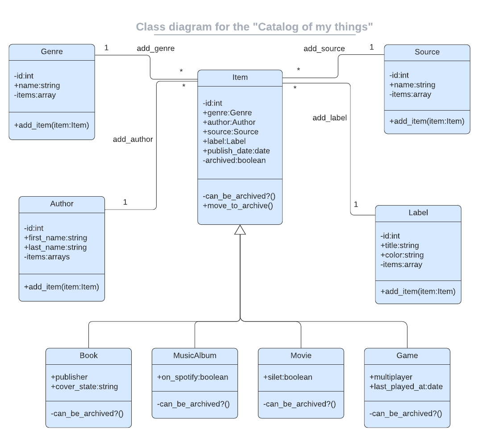

<a name="readme-top"></a>

<div align="center">

  <h3><b>README</b></h3>

</div>

<!-- TABLE OF CONTENTS -->

# 📗 Table of Contents

- [📖 About the Project](#about-project)
  - [🛠 Built With](#built-with)
    - [Tech Stack](#tech-stack)
    - [Key Features](#key-features)
  - [🚀 Live Demo](#live-demo)
- [💻 Getting Started](#getting-started)
  - [Prerequisites](#prerequisites)
  - [Setup](#setup)
  - [Install](#install)
  - [Usage](#usage)
  - [Run tests](#run-tests)
  - [Deployment](#deployment)
- [👥 Authors](#authors)
- [🔭 Future Features](#future-features)
- [🤝 Contributing](#contributing)
- [⭐️ Show your support](#support)
- [🙏 Acknowledgements](#acknowledgements)
- [❓ FAQ (OPTIONAL)](#faq)
- [📝 License](#license)

<!-- PROJECT DESCRIPTION -->

# 📖 Catalog of my things <a name="about-project"></a>

> Lear more about the project below:

**Catalog of my things** is a a console app that will help you to keep a record of different types of things you own:
 books, music albums, movies, and games. Everything is based on the UML class diagram presented below. As well this app is able to preserve the data, data will be saved in the `data` that will contain a JSON file per each item.
 As well We have included a table representation in SQL.

 

#### See Our Video Presentation Below:

[](https://drive.google.com/file/d/1Dzu05UBPL3suVa6LJ6wo5DnWu63K1nEX/view?usp=sharing)
[Click here](https://drive.google.com/file/d/1Dzu05UBPL3suVa6LJ6wo5DnWu63K1nEX/view?usp=sharing)  to see our video presentation.


## 🛠 Built With <a name="built-with"></a>

### Tech Stack <a name="tech-stack"></a>

> Learn more below:

<details>
  <summary>Programming Language</summary>
  <ul>
    <li><a href="https://www.ruby-lang.org/">Ruby</a></li>
  </ul>
</details>

<details>
  <summary>Preserving Data</summary>
  <ul>
    <li><a href="https://www.json.org/json-en.html">JSON</a></li>
  </ul>
</details>
<details>
  <summary>Test</summary>
  <ul>
    <li><a href="https://rspec.info/">Rspec</a></li>
  </ul>
</details>

<details>
<summary>Database</summary>
  <ul>
    <li><a href="https://www.postgresql.org/">PostgreSQL</a></li>
  </ul>
</details>

<!-- Features -->

### Key Features <a name="key-features"></a>

> Some relevant key features below:

- **Add Items like books, games and music albums**
- **Display each kind of item within a list**
- **Preserve de Data in JSON files**


<p align="right">(<a href="#readme-top">back to top</a>)</p>

<!-- LIVE DEMO -->

## 🚀 Live Demo <a name="live-demo"></a>

> Not availabe yet.
<!-- 
- [Live Demo Link](https://google.com) -->

<p align="right">(<a href="#readme-top">back to top</a>)</p>

<!-- GETTING STARTED -->

## 💻 Getting Started <a name="getting-started"></a>

> Would you like to make use of this project?

To get a local copy up and running, follow these steps.

### Prerequisites

In order to run this project you need:

- Ruby pre-installed
- Basic knowledge about how to use the terminal
- Code editor (We do recommend Vscode)

### Setup

Clone this repository to your desired folder:

```sh
  cd my-folder
  git clone git@github.com:Diegogagan2587/catalog-of-my-things.git
```


### Install

Install this project with:

```sh
  cd catalog-of-my-things
  bundle install
```

### Usage

To run the project, execute the following command:

```sh
  ruby main.rb
```


### Run tests

To run tests, run the following command:

```sh
  rspec test/
```

<p align="right">(<a href="#readme-top">back to top</a>)</p>

## 👥 Authors <a name="authors"></a>

👤 **Ricardo Martínez**

- GitHub: [@bohaz](https://github.com/bohaz)
- Twitter: [@Ricardo29115571](https://twitter.com/Ricardo29115571)
- LinkedIn: [Ricardo Martinez](https://www.linkedin.com/in/ricardomart%C3%ADnez%E2%88%B4/)

👤 **Diego Vidal**

- GitHub: [@Diegogagan2587](https://github.com/Diegogagan2587)
- Twitter: [@dieg02587](https://twitter.com/dieg02587)
- LinkedIn: [diego-vidal-lopez](https://www.linkedin.com/in/diego-vidal-lopez/)

👤 **khaled alaa**

- GitHub: [Khaled-Alaa-1](https://github.com/Khaled-Alaa-1)
- Twitter: [@Khaled86756991](https://twitter.com/Khaled86756991)
- LinkedIn: [Khaled Alaa](https://www.linkedin.com/in/khaled-alaa-594bb9256/)

<p align="right">(<a href="#readme-top">back to top</a>)</p>

## 🔭 Future Features <a name="future-features"></a>

- [ ] **User Authentication**
- [ ] **Advanced Searching and Sorting**
- [ ] **Interactive UI/UX**
- [ ] **API Integration**

<p align="right">(<a href="#readme-top">back to top</a>)</p>

## 🤝 Contributing <a name="contributing"></a>

Contributions, issues, and feature requests are welcome!

Feel free to check the [issues page](https://github.com/Diegogagan2587/catalog-of-my-things/issues).

<p align="right">(<a href="#readme-top">back to top</a>)</p>

## ⭐️ Show your support <a name="support"></a>

If you like this project let us know with a STAR⭐!

<p align="right">(<a href="#readme-top">back to top</a>)</p>

## 🙏 Acknowledgments <a name="acknowledgements"></a>

We would like to thaks Microverse for giving us the oportunity to build and contribute in projects like this.

<p align="right">(<a href="#readme-top">back to top</a>)</p>


## 📝 License <a name="license"></a>

This project is [MIT](https://github.com/Diegogagan2587/catalog-of-my-things/blob/development/MIT.md) licensed.

<p align="right">(<a href="#readme-top">back to top</a>)</p>
